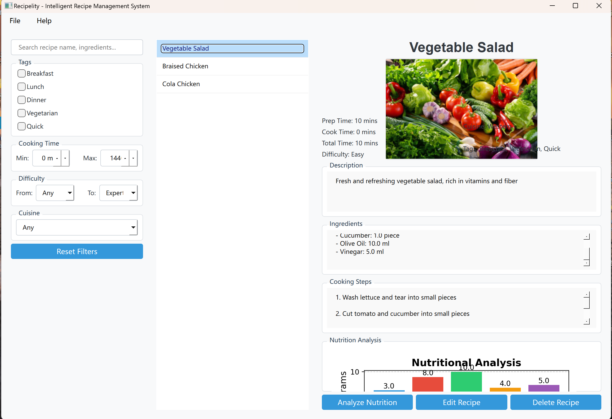

# Recipelity - Intelligent Recipe Management System

## Overview
Recipelity is a powerful recipe management software that supports importing recipes from websites, intelligent search and filtering, and nutrition analysis.


## Features
- **Recipe Collection & Management**: Add, edit, delete, and organize your recipes
- **Web Recipe Import**: Import recipes from popular cooking websites
- **Intelligent Search & Filtering**: Search by keywords, tags, cooking time, difficulty, and cuisine
- **Nutrition Analysis**: Analyze the nutritional content of recipes
- **Food Image Analysis**: Identify ingredients from food images (simulated in this version)

## System Requirements
- Python 3.9+
- PyQt6
- SQLAlchemy
- Requests
- BeautifulSoup4
- Matplotlib
- OpenCV

## Installation
1. Clone the repository:
   ```
   git clone https://github.com/yourusername/recipelity.git
   cd recipelity
   ```

2. Install dependencies:
   ```
   pip install -r requirements.txt
   ```

3. For Python 3.13 compatibility, use:
   ```
   pip install -r requirements_fixed.txt
   ```

## Running the Application
To run the English version of Recipelity:
```
python main_en.py
```

## Usage Guide

### Adding a Recipe
1. Click "File" > "Add Recipe" from the menu bar
2. Fill in the recipe details, including name, description, ingredients, and steps
3. Click "Save" to add the recipe to your collection

### Importing a Recipe from URL
1. Click "File" > "Import Recipe from URL" from the menu bar
2. Enter the URL of a recipe from a supported website
3. Review and edit the imported recipe details
4. Click "Save" to add the recipe to your collection

### Searching and Filtering Recipes
1. Use the search box to find recipes by name or ingredients
2. Filter by tags, cooking time, difficulty, and cuisine using the filter panel
3. Click "Reset Filters" to clear all filters

### Analyzing Nutrition
1. Select a recipe from the list
2. Click "Analyze Nutrition" in the recipe detail panel
3. View the nutritional analysis chart and data

### Analyzing Food Images
1. Click "File" > "Analyze Ingredients from Image" from the menu bar
2. Select an image file containing food
3. View the recognized ingredients
4. Optionally create a new recipe using the recognized ingredients

## Supported Websites for Import
- Meishichina (www.meishichina.com)
- Xiachufang (www.xiachufang.com)
- Douguo (www.douguo.com)
- Generic parsing for other websites

## Data Storage
Recipes are stored in an SQLite database located at `data/recipes.db`.

## Troubleshooting
### Database Issues
If you encounter database path issues, please refer to `DATABASE_FIX.md` for solutions.

### Installation Issues
For installation problems, especially with Python 3.13 compatibility, please refer to `INSTALLation_fix.md`.

## Contributing
Contributions are welcome! Please feel free to submit a Pull Request.

## License
This project is licensed under the MIT License.
